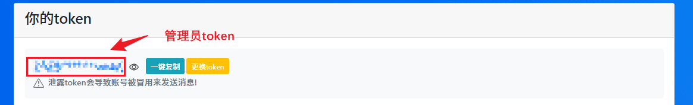

# tech-study-docker

### 描述 Description

- 基于 `Docker` + `Node.js` 的自动化学习强国工具

- 如果感觉配置麻烦，去看看 [油猴插件脚本版](https://github.com/Xu22Web/tech-study-js '油猴插件脚本版') `https://github.com/Xu22Web/tech-study-js`

### 优点 Advantages

- 易于部署，灵活可用的学习强国 `PC 网页版` 任务解决方案

- 基于 `Node.js` 的控制浏览器的行为，安全高效

- 基于 `PushPlus` 推送功能，通过微信远程接收学习情况和服务运行情况

### 部署与运行 Deploy and Run

1. 安装`docker` 以及 `docker-compose`

   <details>
   <summary>
   Windows
    （<a href="https://docs.docker.com/desktop/install/windows-install/">查看官方教程</a>）
   </summary>

   分为基于 `WSL 2` 的 Windows Linux 子系统 以及 基于 `Hyper-V` 的 Windows 容器，具体请参考官方教程

   </details>

   <details>
   <summary>
   CentOS
   （<a href="https://docs.docker.com/engine/install/centos/">查看官方教程</a>）
   </summary>

   1. 卸载老版本 `docker` 或 `docker-engine`

      ```bash
      sudo yum remove docker \
      docker-client \
      docker-client-latest \
      docker-common \
      docker-latest \
      docker-latest-logrotate \
      docker-logrotate \
      docker-engine
      ```

   2. 设置仓库

      ```bash
      sudo yum install -y yum-utils
      ```

      ```bash
      sudo yum-config-manager \
       --add-repo \
       https://download.docker.com/linux/centos/docker-ce.repo
      ```

   3. 安装 `docker` 引擎

      ```bash
      sudo yum install -y docker-ce \
      docker-ce-cli \
      containerd.io \
      docker-buildx-plugin \
      docker-compose-plugin
      ```

   4. 运行 `docker`

      ```bash
      sudo systemctl start docker
      ```

   </details>

   <details>
   <summary>
   Ubuntu
   （<a href="https://docs.docker.com/engine/install/ubuntu/">查看官方教程</a>）
   </summary>

   1. 卸载老版本 `docker` 或 `docker-engine`

      ```bash
      sudo apt-get remove docker docker-engine docker.io containerd runc
      ```

   2. 设置仓库

      1. 更新 `apt` 程序包索引并安装依赖

         ```bash
         sudo apt-get update
         ```

         ```bash
         sudo apt-get install \
         ca-certificates \
         curl \
         gnupg \
         lsb-release
         ```

      2. 添加 Docker 官方 GPG 密钥

         ```bash
         sudo mkdir -m 0755 -p /etc/apt/keyrings
         ```

         ```bash
         curl -fsSL https://download.docker.com/linux/ubuntu/gpg | sudo gpg --dearmor -o /etc/apt/keyrings/docker.gpg
         ```

      3. 设置仓库

         ```bash
         echo \
         "deb [arch=$(dpkg --print-architecture) signed-by=/etc/apt/keyrings/docker.gpg] https://download.docker.com/linux/ubuntu \
         $(lsb_release -cs) stable" | sudo tee /etc/apt/sources.list.d/docker.list > /dev/null
         ```

   3. 安装 `docker` 引擎

      ```bash
      sudo apt-get update
      ```

      > 运行 `apt-get` 更新时收到 GPG 错误?
      >
      > ```bash
      > sudo chmod a+r /etc/apt/keyrings/docker.gpg
      > ```
      >
      > ```bash
      >  sudo apt-get update
      > ```

      ```bash
      sudo apt-get install docker-ce \
      docker-ce-cli \
      containerd.io \
      docker-buildx-plugin \
      docker-compose-plugin
      ```

   </details>

2. 拉取 `docker` 镜像，创建 `tech-study-docker` 容器

   1. 拉取 `docker` 镜像

      ```bash
      docker pull xuzhengze/tech-study-docker
      ```

   2. 创建 `tech-study-docker` 容器

      ```bash
      docker compose up -d
      ```

3. 启用 `PushPlus` 推送

   - 在 [PushPlus 官网](https://www.pushplus.plus/ 'PushPlus 官网') 上，注册登录账号。若有其他用户，可添加为好友，发送[好友消息](https://www.pushplus.plus/liaison.html 'PushPlus 好友消息')。

   - 更改 `Push 配置`（`config/push.ts`），设置管理员`token`（`管理员`能接收到服务推送，`用户`只能收到自己的学习推送）

     ```js
       {
        // 其他配置...
         /**
          * @description 管理员的 token
          */
         token: '管理员 token',
       }

     ```

     

4. 查看更改 `Schedule 配置`（`config/schedule.ts`），单或多个定时任务配置

   ```js
   [
     {
       /**
        * @description 用户昵称
        */
       nick: '用户昵称',
       /**
        * @description 管理员或者好友 token
        */
       token: '用户 token',
       /**
        * @description cron 表达式
        * @example '0 0 12 * * ?' 表示12点, ['0 0 12 * * ?', '0 0 13 * * ?'] 表示12和13点
        */
       cron: '0 0 12 * * ?',
       /**
        * @description 学习项目配置
        * @example  [文章选读, 视听学习, 每日答题, 专项练习]
        */
       taskConfig: [true, true, true, true],
       /**
        * @description 专项练习 答题失败（由于答完结算，仅包含答题异常或无答案）退出不提交
        * @example true 退出答题不提交 false 继续答题
        */
       paperExitAfterWrong: false,
     },
   ];
   ```

   

   

   ```
     # 关于`node-schedule`定时任务的`cron`表达式

     *    *    *    *    *    *
     ┬    ┬    ┬    ┬    ┬    ┬
     │    │    │    │    │    │
     │    │    │    │    │    └ 星期 (0 - 7) (0 或 7 是星期天)
     │    │    │    │    └───── 月 (1 - 12)
     │    │    │    └────────── 日 (1 - 31)
     │    │    └─────────────── 时 (0 - 23)
     │    └──────────────────── 分 (0 - 59)
     └───────────────────────── 秒 (0 - 59，可选)
   ```

5. 进入容器，启动项目

   1. 进入 `tech-study-docker` 容器

      ```bash
      docker compose exec tech-study-docker bash
      ```

   2. 启动 `node` 项目

      ```bash
      pnpm start
      ```
